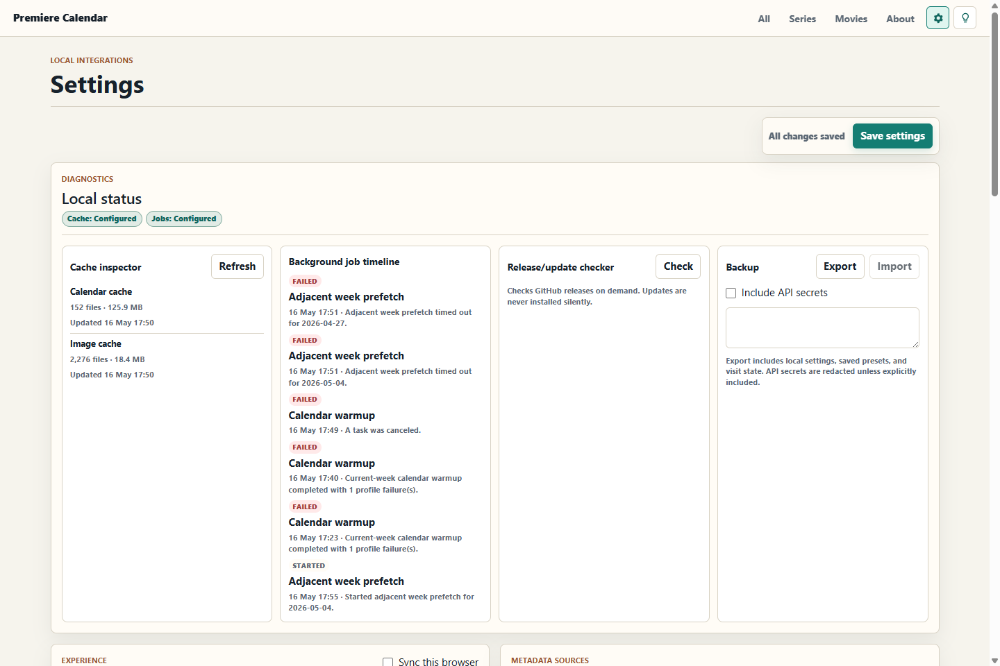

# Premiere Calendar

Premiere Calendar is a web page you run yourself. It shows upcoming movie and series premieres by week.

Use it to:

- Browse new movies and series.
- Filter by language, provider, score, runtime, and more.
- See where each card came from.
- Inspect why a date, source, score, or external ID is missing.
- Add verified movies to Radarr and verified series to Sonarr, if you use those apps.

TMDb is required for live data. Everything else is optional.

## Screenshots

| Dark mode | Light mode |
| --- | --- |
|  |  |

| Movies | Filters |
| --- | --- |
|  |  |

| Local status |
| --- |
|  |

## Deploy With Docker

The supported runtime is the Docker/PostgreSQL stack. Pin
`PREMIERECALENDAR_IMAGE` to an accepted immutable GHCR digest, provide the
PostgreSQL password through the configured Docker secret file, and start
`compose.yaml` with Docker Compose. The app binds to loopback port `18084`
by default; publish it to the trusted private network through the documented
reverse proxy.

If TMDb settings are missing, the calendar automatically opens Settings and shows a setup notice until the required token is saved.

## TMDb Token

TMDb is required. Without it, the app opens but cannot load real calendar data.

1. Create or sign in to a TMDb account.
2. Open your TMDb account API settings.
3. Copy the API Read Access Token, not the short API key.
4. Paste it in the app Settings page and click Save.

## Check It Worked

| Check | Good result |
| --- | --- |
| Containers | App and PostgreSQL report healthy |
| App page | `http://localhost:18084` opens on the Docker host |
| Readiness | `http://localhost:18084/health/ready` says Healthy |
| Version | `http://localhost:18084/health/version` reports PostgreSQL healthy |
| Calendar | All, Series, or Movies loads cards after the TMDb token is saved |

## Open From Another Computer

Use the private HTTPS hostname exposed by the reverse proxy. Keep the app and
PostgreSQL ports off the public internet; only the proxy should cross the
container-host boundary.

Premiere Calendar has no built-in user login. Keep the service on a trusted LAN or VPN, and avoid exposing it directly to the public internet.

## Develop From Source

Local development is container-only: Docker Engine runs inside Ubuntu 24.04 on WSL, and Compose supplies both the app SDK and a dedicated PostgreSQL database. No host .NET or PostgreSQL installation is required for the development workflow.

```powershell
.\eng\wsl-docker.ps1 up
```

Open `http://localhost:5299`. Use `test`, `logs`, `down`, or `reset` as the action when needed. `reset` removes only the PremiereCalendar development containers and named development volumes.

See [Docker and PostgreSQL](docs/DockerAndPostgres.md) for production Compose, migration, health, security, backup, and recovery details. The supported operational deployment is the Docker/PostgreSQL stack.

## Navigation And Shortcuts

| What you want | What to do |
| --- | --- |
| Go to the previous day | Press Left Arrow |
| Go to the next day | Press Right Arrow |
| Pick a day in the week | Click the day button |
| Go to another week | Use Previous, This week, or Next |
| Move from the top of a day to yesterday | Keep scrolling upward until the message appears |
| Move from the bottom of a day to tomorrow | Keep scrolling downward until the message appears |
| See which sources loaded | Open Source details when source diagnostics are shown |
| See cache age | Check the data freshness pill above the day strip |
| Save filter combinations | Open Actions, enter a preset name, and click Save preset |
| Apply a saved filter preset | Open Actions, choose a preset, and click Apply preset |
| Open Actions | Press Ctrl+K, or Cmd+K on macOS |
| Close Actions | Press Escape |
| Copy the current filtered view | Open Actions and click Copy view link |
| Export visible premieres | Open Actions and choose ICS, CSV, or JSON |
| Fit more cards on screen | Open Actions and choose Use compact cards |
| Change filters | Click the filter button; a small badge shows how many filters are active |
| Review active mobile filters | Open the filter button; the compact review is at the top of the pane |
| Change settings | Click the cog icon |

The arrow keys do not take over while you are typing in a text box.

## Sync Viewing Between Devices

View sync is optional. It lets two or more browsers follow the same calendar URL.

1. Open Settings.
2. Find View sync.
3. Give this browser a name, such as `Office PC`.
4. Create or select a group.
5. Turn on Sync this browser.
6. Save view sync.

Do the same on another computer and choose the same group. When one grouped browser changes day, week, route, or filters, the other grouped browsers follow the latest view. Use Ungroup this device to stop syncing that browser.

Settings shows one block per sync group. Each block lists the attached browsers and the latest saved URLs for All, Series, and Movies. The current browser is marked `me`, and the active group is highlighted.

All, Series, and Movies keep separate synced views. A browser on Series follows only the latest Series URL, not Movies or All. Opening All, Series, or Movies without filters first uses that group's saved URL for the same route. Local saved filters are only the fallback when the browser is not in a group or that group has no saved URL for the route. Settings, About, external links, credentials, and host names are not synced.

## What The Cards Mean

- Normal cards are verified through TMDb.
- Unverified cards are shown below normal cards when an outside source found something that does not match TMDb yet.
- `Source` chips show provider, channel, or streaming source names when known.
- Scores are ordered IMDb, TMDb, Rotten Tomatoes audience, then Rotten Tomatoes critics. Missing and zero scores are omitted from the render tree.
- Open the provenance details on a card to see date confidence, source merge contributions, matched IDs, and missing-data reasons.

## Providers

| Provider | Needed? | What it does |
| --- | --- | --- |
| TMDb | Required | Main calendar data, posters, trailers, metadata |
| IMDb datasets | Included | IMDb scores and vote counts, cached locally |
| Trakt | Optional | Extra movie and new-series candidates |
| TVmaze | Optional | Extra series schedule data |
| Watchmode | Optional | Streaming availability fallback |
| OMDb | Optional | Rotten Tomatoes, Metacritic, plot and poster fallback |
| Fanart.tv, TheTVDB, Wikimedia | Optional | Poster fallback when TMDb has no poster |
| SIMKL | Optional | Account/library sync state |
| Sonarr, Radarr | Optional | Add buttons on verified cards |

## Cache

The app keeps calendar data, images, IMDb scores, OMDb responses, view-sync groups, and small provider sync markers on disk. This means cached data survives restarts, crashes, and updates.

Use Update when you want to reuse fresh local cache where possible. Use Refresh sources when you want the visible week checked against providers again. Refresh sources keeps useful existing data where possible and fills in changes or missing details. TMDb, TVmaze, and SIMKL have change/activity endpoints; the app records those checks so later cache decisions have dates to compare against. IMDb scores come from the daily IMDb dataset, not a per-item change API.

Settings includes a Local status center with a cache inspector, background job timeline, source health drilldown, release/update checker and installer, settings backup/restore box, score backfill, and missing-ID repair. The Settings Update button consumes the signed GitHub asset feed with certificate pinning, immutable version directories, expected-version health checks, persistent transcripts, and automatic activation rollback. The updater is disabled in container mode. GitHub does not automatically build, test, publish, or release PremiereCalendar. The CI and container workflows are manual-only safety tools and run solely when an operator explicitly selects **Run workflow**.

## Common Problems

| Problem | Try this |
| --- | --- |
| No cards load | Add a TMDb token in Settings, then click Refresh sources |
| IMDb scores are missing | Wait for the IMDb dataset import to finish, then click Refresh sources |
| Rotten Tomatoes or Metacritic is missing | Enable OMDb with a working API key, then use Settings > Backfill scores |
| IMDb/TVDB IDs are missing | Use Settings > Repair IDs after TMDb is configured |
| A source looks slow | Open Settings and check the Local status background job timeline |
| TVmaze is slow | Use narrower filters or disable TVmaze schedule discovery in Settings |
| Settings look wrong | Change them in the app Settings page, not in `appsettings.json` |
| Posters are missing | Check optional artwork providers, then click Refresh sources |

More help: [Troubleshooting](docs/Troubleshooting.md).

## Test It

```powershell
.\.dotnet\dotnet.exe test .\PremiereCalendar.slnx
```

Tests use fake providers. They must not call live external services.

## More Documentation

Most users only need this README and [Troubleshooting](docs/Troubleshooting.md).

Technical references:

- [Release Installer](docs/ReleaseInstaller.md)
- [Signed GitHub Releases and Updates](docs/ReleaseUpdates.md)
- [Configuration](docs/Configuration.md)
- [How It Works](docs/HowItWorks.md)
- [Architecture](docs/Architecture.md)
- [Performance Notes](docs/PerformanceReview.md)
- [Testing](docs/Testing.md)
- [Docker and PostgreSQL](docs/DockerAndPostgres.md)
