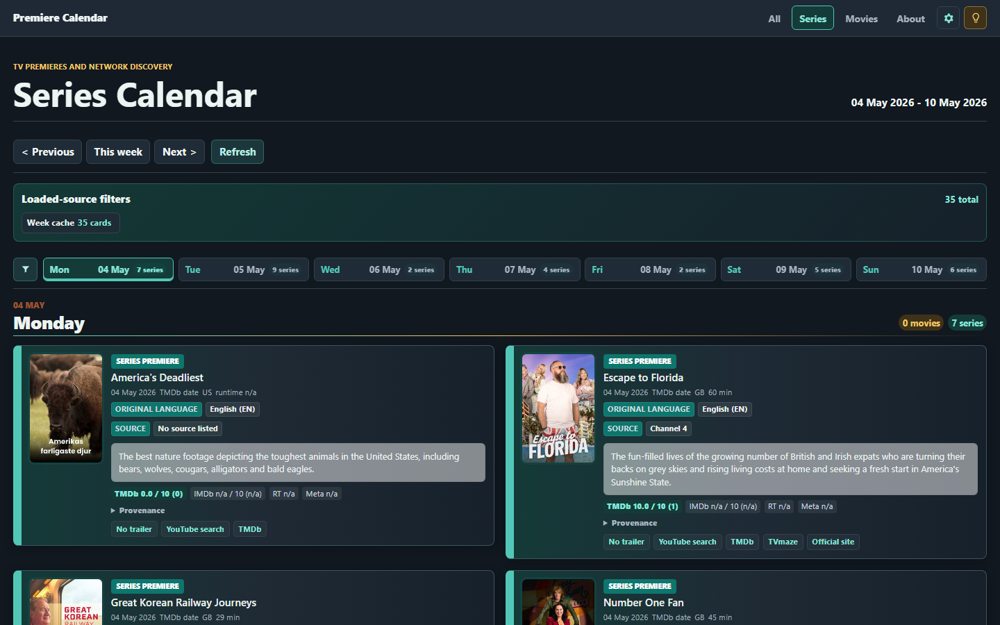
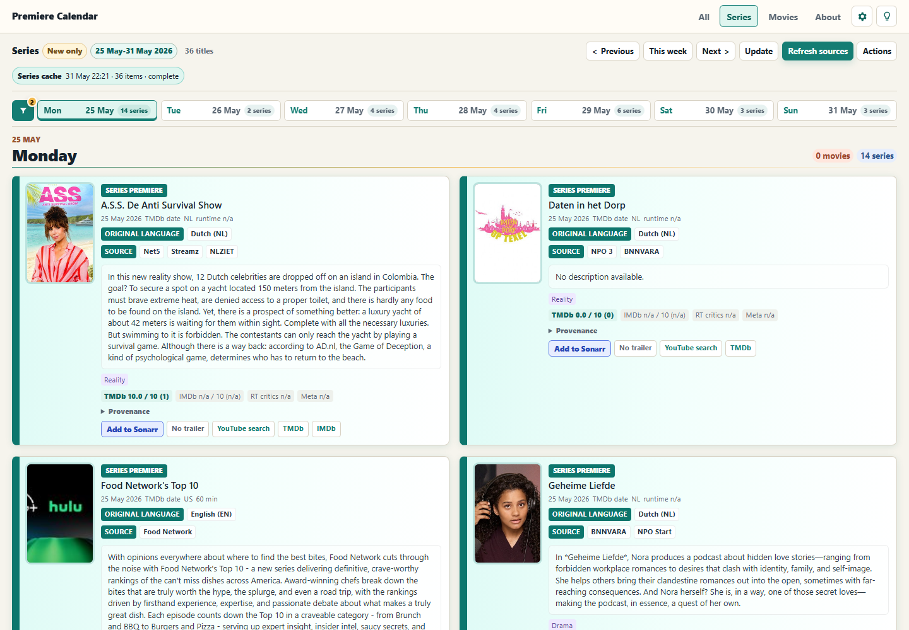
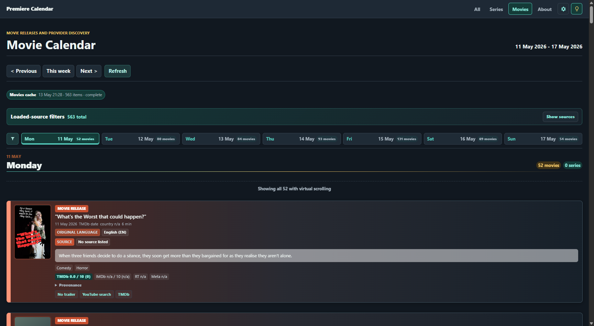
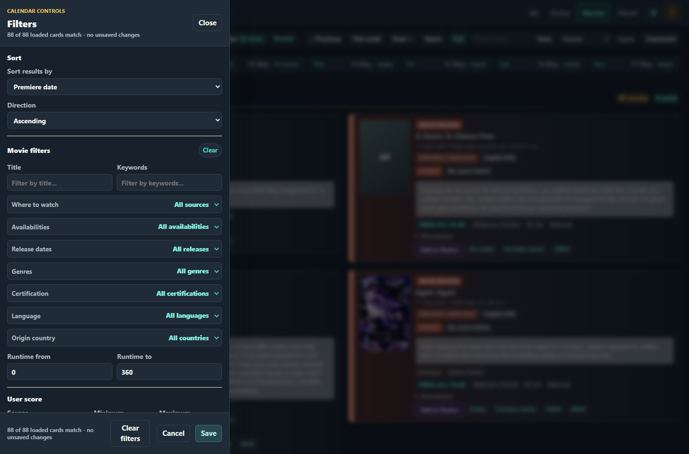

# Premiere Calendar

Premiere Calendar is a local-first .NET 11 preview Blazor app for weekly movie and series discovery. TMDb is the canonical source for normal cards; Trakt and TVmaze can add extra candidate rows when they map to TMDb, while OMDb, Watchmode availability, Fanart.tv, TheTVDB, Wikimedia, Sonarr, Radarr, and SIMKL are optional enrichments or integrations configured from Settings.

Runtime keys are stored in the local SQLite settings database. User-secrets and environment variables remain first-run fallbacks, but secrets should not be committed.

## Screenshots

| Dark mode | Light mode |
| --- | --- |
|  |  |

| Movies | Filters |
| --- | --- |
|  |  |

## What It Does

- Builds Monday-to-Sunday calendars for All, Series, and Movies routes.
- Pushes supported saved filters into TMDb Discover instead of always fetching the broad week.
- Streams source progress so cards can appear before every source finishes.
- Shows unverified external candidates below verified TMDb-backed cards when a provider row cannot yet resolve to TMDb.
- Persists week JSON cache and image cache on disk, with 60-day cleanup for old runtime data.
- Warms reusable full-week cache keys in the background without forcing fresh remote calls every wake.
- Keeps foreground loads bounded by a 30-second budget and shows partial/stale diagnostics instead of a stuck loader.

## Provider Roles

| Provider | Role |
| --- | --- |
| TMDb | Required discovery, identity, metadata, posters, watch providers |
| Trakt | Optional calendar candidates, accepted only after TMDb mapping |
| TVmaze | Optional series schedule candidates and TV enrichment |
| Watchmode | Optional streaming availability fallback only |
| OMDb | Optional IMDb, Rotten Tomatoes, Metacritic, plot, poster fallback |
| Fanart.tv / TheTVDB / Wikimedia | Optional artwork fallbacks when no better poster exists |
| SIMKL | Optional account/library sync state, not calendar discovery |
| Sonarr / Radarr | Optional add actions from verified cards |

## Run Locally

```powershell
.\Run-PremiereCalendar.ps1
```

The script builds, opens `http://localhost:5298`, and runs in the current terminal until Ctrl+C. Use `-Port 5301` if the default port is busy.

Manual run:

```powershell
.\.dotnet\dotnet.exe run --project .\PremiereCalendar\PremiereCalendar.csproj
```

Open `/settings` from the cog icon and add at least a TMDb API read access token for live data.

## Install Or Update As A Service

From the repository root:

```powershell
.\Install-PremiereCalendar.ps1
```

The installer publishes a self-contained Windows x64 build, preserves runtime data, installs or updates the `PremiereCalendar` Windows Service, starts it, and checks `/health`.

Useful options:

```powershell
.\Install-PremiereCalendar.ps1 -Port 5301
.\Install-PremiereCalendar.ps1 -TargetDirectory '<install-directory>'
.\Install-PremiereCalendar.ps1 -SkipServiceInstall
```

For a portable release zip:

```powershell
.\Build-ReleasePackage.ps1
```

See [Release Installer](docs/ReleaseInstaller.md) for install, update, and uninstall details.

## Validate

```powershell
.\.dotnet\dotnet.exe test .\PremiereCalendar.slnx
```

Automated tests use fakes and fixtures. They must not call live external providers.

## Documentation

- [How It Works](docs/HowItWorks.md)
- [Architecture](docs/Architecture.md)
- [Configuration](docs/Configuration.md)
- [Troubleshooting](docs/Troubleshooting.md)
- [Release Installer](docs/ReleaseInstaller.md)
- [Performance Notes](docs/PerformanceReview.md)
- [Testing](docs/Testing.md)
