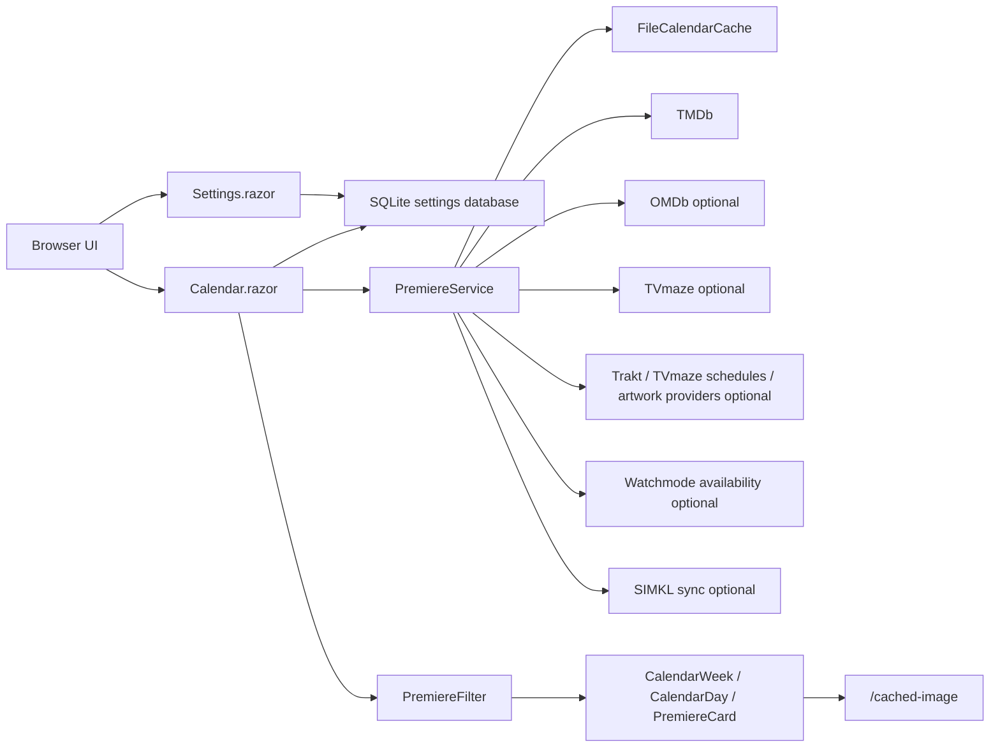

# How It Works

Premiere Calendar is a server-rendered Blazor application that builds a weekly premiere calendar from TMDb, enriches those rows with optional external metadata, caches normalized weeks locally, and sends saved TMDb-supported filters into Discover requests so filtered views do not always need the broad full-week result set.

## Mental Model

The application has one source of truth for calendar rows:



TMDb is the canonical identity source. TMDb Discover creates the primary verified rows. Trakt and optional TVmaze schedules can add candidates; mapped candidates become verified cards, while unmapped candidates are retained as unverified external cards below the verified results. In the new-series view, TVmaze later episodes are filtered out before TMDb mapping; `S01E01` candidates can still support a series-premiere card. Watchmode is streaming availability fallback only. SIMKL is account/library sync state, not calendar discovery. Draft filter changes never call external APIs; saved filters do. Runtime API and integration credentials are read from the local SQLite settings database.

## Request Flow

1. `Calendar.razor` reads query parameters, resolves the active route (`/`, `/series`, or `/movies`), calculates the Monday-to-Sunday week, and calls `IPremiereService.GetPremieresAsync`.
2. `Calendar.razor` converts the saved filters into `PremiereDiscoveryCriteria`. With no filters this criteria is broad and the series scope defaults to every episode airing in the week; with saved filters it contains the TMDb-supported request filters.
3. `PremiereService` first checks `FileCalendarCache` for a fresh week file matching the week plus criteria hash unless the user clicked Refresh.
4. On a cache miss, `PremiereService` starts the needed external providers plus a bounded number of TMDb source batches in parallel. Trakt and TVmaze schedules are separate source streams, so the UI can show which provider is still loading. Series uses one `air_date` request per day for every-episode mode, or `first_air_date` week requests for new-series-only mode. Movies are also split into one day-sized source batch during fresh week orchestration. If multiple original languages are selected, those TMDb calls are fanned out into independent source work per language because TMDb Discover accepts one `with_original_language` value per request. It does not apply hidden presets; it only sends filters selected in the UI and supported by TMDb Discover.
5. `TmdbClient` fetches Discover page 1 first to learn `total_pages` and yields that first page immediately. It then fetches pages 2 through N in configurable chunks (`Tmdb:PageBatchSize`, default 10 pages, about 200 TMDb rows per chunk) with bounded page concurrency. Each TMDb request goes through the local token-bucket limiter and `429` retry path.
6. Optional discovery providers fetch Trakt calendars and TVmaze schedules. External candidates without TMDb IDs are resolved through TMDb external-ID lookup and strict title/year fallback. Candidates that still cannot map are kept as unverified external cards instead of being thrown away. External candidates are batched before mapping so TVmaze schedule rows can use the same bounded TMDb resolution/enrichment concurrency as larger TMDb result sets. When TVmaze supplies a known show language and the saved original-language filter does not include it, the candidate is skipped before TMDb resolution.
7. Each accepted item is normalized into a `PremiereItem` with a stable canonical ID: `tv:{tmdbId}` for series premieres, `tv:{tmdbId}:air:{yyyyMMdd}` or `tv:{tmdbId}:s{season}e{episode}` for series episodes, and `movie:{tmdbId}` for movies.
8. Detail enrichment runs with bounded concurrency so a busy week does not create unbounded external calls.
9. Each source batch is yielded from `IPremiereService.StreamPremieresAsync` as soon as partial data is ready. The page updates cards while later pages, days, and providers are still running. The Loaded-source filters panel is collapsed by default and shows only the total card count; Show sources expands provider chips with counts, progress, and diagnostics. The chips can be clicked to show only one loaded source without making another API request. If the foreground load budget expires, the page stops waiting and renders the best available partial or cached result.
10. The filtered normalized result set for that week and criteria hash is written to `App_Data/cache/calendar`. Week cache writes are atomic: the app writes a temporary file first and replaces the final cache file only after serialization succeeds.
11. The UI still applies `PremiereFilter` in memory for local-only filters and final consistency, then renders one selected day. Left Arrow and Right Arrow move between days. Overscrolling at the top moves to yesterday; overscrolling at the bottom moves to tomorrow. Moderate days render 10 cards at a time and auto-load more while browsing. Days over 40 items switch to .NET 11 Blazor `Virtualize`.
12. Poster/backdrop URLs are routed through `/cached-image`, which stores image bytes locally under `App_Data/cache/images`. Poster cards include `w=185`, so the cache stores a displayed-size variant for the card. TMDb poster URLs that already use the requested card width are stored directly; larger variants and non-TMDb posters are resized to a JPEG variant. Cards place the real image URL in `data-lazy-src`, so the browser does not request offscreen images until they are near the viewport.
13. After the visible week finishes loading, `AdjacentWeekPrefetcher` warms nearby week caches in the background with the same saved filters, without blocking the page. `CurrentWeekCalendarWarmupService` also runs on startup and wakes periodically to warm stale or missing full-week media caches for today, nearby days, the rest of the current week/month, adjacent months, and months +2 through +6. Routine warmup uses `forceRefresh: false`, so fresh disk and memory cache entries are reused. If the app is stopped while prefetch or warmup is running, later cache checks resume only missing or stale weeks.

## External Sources

TMDb is required. It provides discovery, core metadata, TMDb scores, posters/backdrops, videos, genres, keywords, external IDs, TV networks, and watch providers. The TMDb API read access token is stored from the Settings page in the local database.

IMDb datasets are included. The app imports IMDb's non-commercial ratings dataset into SQLite and uses it for IMDb scores and vote counts when a card has an IMDb ID.

OMDb is optional. When enabled in Settings with an API key, it enriches exact IMDb ID matches with Rotten Tomatoes, Metacritic, plot, and poster fallback data. OMDb responses are persisted and rate-limit cooldowns are remembered.

TVmaze is optional and enabled by default. It enriches TV rows through exact TheTVDB or IMDb IDs, adding network names, web-channel names, TVmaze ratings, official site links, summaries, and fallback TV artwork. Schedule discovery is enabled by default for the global web schedule only; set schedule countries in Settings for explicit broadcast-country schedule calls. In every-episode mode, mappable TVmaze schedule rows can add exact season/episode cards. In new-series-only mode, ordinary schedule episodes are skipped so the page stays focused on new shows.

Fanart.tv is optional and uses a free API key configured in Settings. It enriches missing posters from TMDb movie IDs and TV TheTVDB IDs. English artwork wins, then Dutch, then neutral-language assets, with likes used as a tie-breaker.

Trakt is optional and uses a free app client ID configured in Settings. It contributes candidate movie and new-show calendar rows once the client ID is configured. Candidates that resolve to TMDb become normal verified cards; unresolved candidates can appear as unverified cards.

Watchmode is optional and uses an API key configured in Settings. It is used only as a fallback for missing streaming availability when TMDb has no provider data. Release discovery is not part of the default calendar pipeline because the free API is too request-limited for reliable broad-week refreshes.

SIMKL is optional account/library sync state. It uses client credentials plus an OAuth access token obtained through the PIN flow. It does not create calendar discovery rows.

TheTVDB is optional and API-key gated through Settings. It is only an artwork fallback for series that already have a TMDb/TheTVDB identity.

Wikimedia/Commons is enabled by default as a conservative final image fallback. It only uses TMDb-provided Wikidata IDs and only accepts Commons files with reusable license metadata.

## Source Chips

Cards show an `Original language` chip with a readable language name and ISO code when TMDb supplies one, for example `English (EN)` or `Dutch (NL)`. If a discovery source does not provide the language directly, normalization falls back to TMDb details before rendering `n/a`.

Cards also show a `Source` row for provider/channel names.

For TV rows, source names are collected in this order:

1. TVmaze network name.
2. TVmaze web-channel name.
3. TMDb TV networks.
4. TMDb watch providers.

For movie rows, source names come from TMDb watch providers.

Watch-provider names are merged from every TMDb region returned in the detail response by default. If `Tmdb:SourceRegions` is explicitly configured, those regions are used only for source-chip ordering and release/certification preference, not for discovery filtering. The list is de-duplicated case-insensitively before rendering. If no source is available, the card shows `No source listed`.

TMDb's movie and TV filter surfaces are not identical. Movies use release-date filters and do not expose a `Network` filter. TV uses first-air-date filters and can filter by network. The app mirrors that distinction in the UI filter pane and sends matching saved filters into Discover where possible.

## Sonarr And Radarr Adds

The cog icon in the top bar opens the Settings page. Sonarr, Radarr, and source API settings are stored server-side in the local SQLite parameter database, not in browser storage. Each integration has an enable flag; disabling Sonarr removes the `Add to Sonarr` card action, and disabling Radarr removes the `Add to Radarr` action.

The Settings page can call Sonarr/Radarr for root folders and quality profiles. Root folders are offered as input suggestions, and quality profiles are shown as name-based dropdowns after options are loaded. The app still stores the selected profile ID because that is what the Sonarr/Radarr add endpoints require.

Movie cards use Radarr. The server sends the card's TMDb movie ID to Radarr lookup, merges the configured root folder, quality profile, monitoring, minimum availability, tag-on-add, and search-after-add settings into the add payload, and posts it to Radarr.

Series cards use Sonarr. Sonarr is TVDB-based, so the app uses the card's enriched TVDB ID. If no TVDB ID is available, the app shows a failure notification instead of creating an ambiguous series. Otherwise it looks up the series in Sonarr, applies the configured root folder, quality profile, series type, monitor mode, season-folder, tag-on-add, and search-after-add settings, and posts it to Sonarr.

Each integration has a `Tag on add` setting. The default is `import`. If the configured tag is not present in Sonarr/Radarr, the app creates it through the target app's tag API and includes that tag ID in the add payload. If the field is empty, the app does not call the tag API and sends no tag.

Add results are shown in a top-right toast notification and disappear automatically after three seconds. Existing Sonarr/Radarr entries are reported as already present rather than added again.

## Cache Layers

There are five cache layers:

- `TmdbClient` memory cache: TMDb discover responses for six hours, TMDb details for twelve hours, and external-ID lookup responses for seven days.
- Source-client memory caches: TVmaze, Fanart.tv, Trakt, Watchmode, SIMKL, TheTVDB, Wikimedia, and OMDb cache source responses or negative lookups according to their expected volatility.
- SQLite provider caches: IMDb dataset ratings, OMDb responses/cooldowns, most-used filters, and provider change markers.
- `FileCalendarCache`: normalized filtered results by week plus criteria hash under `App_Data/cache/calendar`.
- `FileImageCache`: remote poster/backdrop bytes and width-specific poster variants under `App_Data/cache/images`.

TMDb, TVmaze, Watchmode, OMDb, and image-cache misses use keyed single-flight coalescing so several concurrent requests for the same key share one upstream request while the cache entry is being filled.

The SQLite database stores small mutable state: settings, IMDb ratings, OMDb cache rows, filter usage, and provider sync markers. Week result JSON and image bytes stay in file caches so they can be streamed efficiently and cleaned independently.

The week cache filename includes the selected server-discovery criteria hash. If no request filters are saved, the key is `default`. Criteria that change source requests, such as media type, language, origin, genres, provider IDs, availability, runtime, keywords, release types, certification, TV networks, TV status/type, TMDb score range, and minimum votes, produce different cache files. View-only choices such as local title search, local source text, and final UI sort do not create duplicate source cache files; the UI applies those in memory after the week loads.

During forced refresh, cached week items that are less than twelve hours old are also used as an enrichment seed. TMDb discover still decides which rows belong in the refreshed week, but matching cached rows keep known source names, external IDs, runtime, trailer, and rating data while discover metadata such as date, title, overview, score, and poster path is updated from the fresh response. External schedule candidates can also reuse cached TMDb/TVDB/IMDb mappings, avoiding repeated TMDb find/detail calls for already-known episodes.

Provider change checks run in the background when available. TMDb exposes movie/TV change lists, TVmaze exposes show update timestamps, and SIMKL exposes activity timestamps for account sync. The app records those globally and per item/week. OMDb and IMDb datasets do not have per-item delta APIs, so OMDb uses cached exact-ID responses and IMDb ratings refresh from the full dataset.

Adjacent-week prefetch uses the filters from the visible week. It warms nearby weeks with the current saved source-request filters and calls the normal premiere service with `forceRefresh: false`, so fresh matching cache files return immediately while missing or stale cache files are filled. By default the queue warms four future weeks and two past weeks in priority order after the visible week finishes. The queue is priority-based rather than FIFO, so a navigation to the previous or next week promotes that new window's adjacent weeks before older far-away pending entries.

Refresh bypasses the fresh week cache for the visible week and saved criteria, then requests fresh source rows. When a matching week cache already exists, fresh cached card enrichment is reused for matching canonical IDs so a refresh does not refetch TMDb details, TVmaze enrichment, OMDb ratings, or external-ID mappings for rows that were already enriched recently. Source and enrichment batches are merged and shown incrementally as they finish. Broad TMDb page batches are still fetched efficiently, and raw TMDb metadata is emitted before slower detail enrichment so cards can appear almost immediately. If source refresh fails before any source returns items and an expired matching cache file exists, the app can fall back to that stale result instead of showing an empty calendar. A cached future week can therefore be up to `CalendarCache:WeekCacheHours` old unless the user opens that week and clicks Refresh.

Broad discovery can exceed five TMDb pages. The default configuration now allows complete broad retrieval up to TMDb's 500-page ceiling and relies on page-batch streaming, request throttling, and bounded enrichment to keep the UI responsive. Lower `Tmdb:MaxUnfilteredPagesPerQuery` or `Tmdb:MaxPagesPerQuery` only if you explicitly want a hard technical cap and accept incomplete results.

When external schedules provide exact season and episode numbers for a show/day, the generic TMDb air-date row for that same show/day is hidden. Separate exact episodes are still kept, so a day with S01E09 and S01E10 shows both exact episode cards and not an additional generic duplicate.

## Filtering

Filters are draft UI state until Save is clicked. Closing or canceling the pane discards draft changes. Save updates the URL and applies the saved filter state. Source-affecting filters reload the visible week with TMDb-supported filters in the request, then apply any remaining local filters in memory. View-only changes such as sort mode or URL canonicalization are applied locally and do not start a new source load. The pane has a page-level `Clear filters` action, and each series/movie filter section has its own `Clear` action for resetting just that media group.

The combined calendar at `/` supports:

- Media type: series, movies, or both.
- Sort mode and direction.
- Separate TV-series filters followed by separate movie filters.
- Calendar row scope for series: every episode or new series only. This is an app-specific calendar control that maps to TMDb `air_date` versus `first_air_date` requests; it is not a literal TMDb filter-label list.
- TMDb genre values from the movie and TV genre-list endpoints.
- TMDb language and country values from the configuration endpoints. Original language and origin country both use the same checkbox dropdown pattern as the other multi-select filters.
- TMDb watch-provider values and watch-country selection. TMDb requires a watch country when requesting provider or availability filters, so provider filters are sent to TMDb only when the UI watch-country field is selected. When the global TMDb provider catalog contains duplicate display names with different IDs, the filter pane shows one checkbox and sends all matching provider IDs.
- TMDb movie certification values from the movie certification endpoint.
- TMDb-style availability checkboxes: stream, free, ads, rent, and buy.
- Movie-only release-type filters: premiere, theatrical limited, theatrical, digital, physical, and TV.
- Series-only TV network text filtering, status filtering, and type filtering.
- TMDb user-score range.
- Minimum TMDb vote count.
- Per-media runtime range, keyword text, selected providers/channels, and original language.

Saved filters sent to TMDb Discover include media type, series row scope (`air_date` versus `first_air_date`), original language, origin country, genres, watch providers when a watch country is selected, watch monetization types when a watch country is selected, TMDb score range, minimum TMDb votes, runtime, keyword IDs resolved through TMDb keyword search, movie release types, movie certifications when all selected certifications share one country, selected TV networks when the selected source has a TMDb network ID, and TV status/type. Movie requests use the global `primary_release_date` window by default; when a watch country is selected, they use TMDb's country-aware `release_date` window with `region` set to that same country. TMDb requests use stable date sorting for cache reuse; the selected UI sort is applied locally after loading. Multiple selected original languages create multiple TMDb request slices and a criteria-specific cache key for that language set.

Filters kept local after loading include free-text TV network/provider matching and any legacy query parameters that no longer appear in the visible TMDb-style filter pane.

Saved filters are written to query parameters, but generated URLs omit default values. A copied URL restores the same week and filter state, including selected provider/channel sources and comma-separated language selections such as `seriesLang=en,nl`; defaults such as `sort=date`, `dir=asc`, `lang=both`, `origin=all`, score `0-10`, minimum votes `0`, and runtime `0-360` are not written. The browser also stores the last saved non-default filter query in `localStorage` separately for `/`, `/series`, and `/movies`, without the week; opening one of those routes without meaningful query filters restores only that route's saved filters without pinning an old week. Week-only URLs and older default-only URLs such as `?week=2026-05-04&sort=date&min=0` do not block restoration.

The `/series` route locks the media request to series and shows only TV-oriented controls. The `/movies` route locks the media request to movies and shows only movie-oriented controls. This mirrors TMDb's split between TV network filtering and movie-specific release/provider filters without duplicating the data pipeline.

## UI Layout

The app uses a top navigation bar with combined, series, movie, and About routes, and gives the calendar the full page width.

On desktop, the week renders as one selected day inside a max-width `1920px` calendar. The sticky day bar is the navigation surface: clicking a day updates the selected day and scrolls the board back to the top. Cards are laid out two per row when the viewport has room. Moderate days start with 10 cards and continue loading in 10-card batches as the scroll sentinel approaches the viewport; very dense days switch to .NET 11 Blazor `Virtualize`.

On mobile, the day selector remains sticky and cards use the full available width.

Movie and series cards use different accent colors so the type is visible at a glance. Descriptions are never line-clamped; the full description remains visible.

The filter pane is its own component with local draft state. Search text, checkbox toggles, and dropdown changes in the pane only rerender the pane; the calendar board is not filtered, reloaded, or rebuilt until Save. The page memoizes the current visible item list and recalculates it only after loaded items, saved filters, source-progress scope, or route mode changes.

The top-bar lightbulb toggles light and dark themes. The selected theme is stored in browser local storage as `premiere-calendar:theme`, not in the server API/week cache. The same non-secret value is mirrored to a `premiere-calendar-theme` cookie so the server can render `<html data-theme="dark">` or `<html data-theme="light">` on the first response. The head script still checks local storage before CSS loads, then the theme script re-applies the saved value after route/enhanced-navigation events and if another render resets the root `data-theme` attribute.

Client-side lazy images, day auto-loading, and filter-pane swipe closing share one requestAnimationFrame-batched DOM observer. Feature scripts receive only the added roots they need to scan, which keeps virtualized row mounts from triggering multiple full-document rescans. Day highlighting does not use a scroll observer; selected day state lives in Blazor.

## Images

`PremiereCard` never links directly to remote images. It sends the remote URL to `/cached-image`, which:

1. Validates the remote host against the image cache allow-list.
2. Downloads the bytes when missing or explicitly refreshed.
3. Optionally resizes poster requests that include `w` into a width-specific JPEG variant and keys that variant separately from the original source URL.
4. Saves the file under the local image cache directory without buffering the whole image in the final response path.
5. Serves the cached file as a stream with browser cache headers, ETags, and `304 Not Modified` support.

If image caching is disabled, `/cached-image` still applies the same HTTPS and host allow-list checks before redirecting the browser to the remote image URL.

Artwork priority is TMDb poster, TMDb detail/image poster, Fanart.tv, OMDb poster, TVmaze image list/enrichment, TheTVDB, Wikimedia/Commons, and finally TMDb backdrop.

External artwork providers are not called when TMDb already has a poster. This keeps the common path fast and avoids spending quota on images that cannot win the priority order.

## Failure Behavior

External-source failures are handled narrowly:

- TMDb discovery failure can fall back to an expired week cache if one exists.
- If one discovery source fails but another returns items, the week still renders the successful source results.
- TMDb detail failures skip detail enrichment for that item.
- Missing OMDb, TVmaze, Fanart.tv, Trakt, TheTVDB, or Wikimedia data shows `n/a`, `No source listed`, or omits optional links rather than failing the page.
- Image failures affect that image only; the card still renders with a placeholder.

## Hosting

The app is configured to listen on:

```text
http://0.0.0.0:5298
```

That makes it reachable from other LAN devices when Windows Firewall allows inbound TCP `5298`.

Use the root `Install-PremiereCalendar.ps1` wrapper for source-tree app updates. It publishes the self-contained build, copies it to the configured install directory while preserving runtime data, and installs or updates the automatic Windows Service. The wrapper restarts itself elevated when service installation needs administrator rights. `Run-PremiereCalendar.ps1` is the foreground build-and-run helper for local development and does not install a service.

The health endpoint is:

```text
GET /health
```

## Key Files

- `PremiereCalendar/Components/Pages/Calendar.razor` - page state, query parameters, memoized visible items, refresh, and week loading.
- `PremiereCalendar/Components/Shared/CalendarFilterDialog.razor` - filter pane with local draft state, Save/Cancel behavior, and page-mode-aware clearing.
- `PremiereCalendar/Services/CalendarFilterState.cs` - filter clone, normalize, and route-mode locking helpers.
- `PremiereCalendar/Services/AdjacentWeekPrefetcher.cs` - background warming for nearby full-week caches around the visible week.
- `PremiereCalendar/Components/Shared/MediaFilterPanel.razor` - TMDb-style per-media filter groups for series and movies.
- `PremiereCalendar/Components/Shared/CalendarWeek.razor` - sticky day selector and one mounted selected-day section.
- `PremiereCalendar/Components/Shared/CalendarDay.razor` - per-day grouping, render fingerprinting, 10-card batching, scroll auto-load sentinels, and .NET 11 Blazor `Virtualize` for dense days.
- `PremiereCalendar/Components/Shared/PremiereCard.razor` - poster, metadata, source chips, scores, links, description, and card-level render fingerprinting.
- `PremiereCalendar/wwwroot/dom-observer.js` - shared batched DOM initializer for lazy images, filter-pane swipe setup, and day auto-loading.
- `PremiereCalendar/Services/PremiereService.cs` - orchestration, normalization, enrichment, de-duplication, and week cache writes.
- `PremiereCalendar/Services/PremiereDiscoveryCriteria.cs` - converts saved UI filters to TMDb-supported request filters and cache keys.
- `PremiereCalendar/Services/PremiereLoadProgress.cs` - source-batch progress messages used by the page during fresh loads.
- `PremiereCalendar/Services/TmdbClient.cs` - TMDb HTTP calls, paging, and memory cache.
- `PremiereCalendar/Services/TmdbFilterCatalogService.cs` - TMDb genre, language, country, watch-provider, and certification filter catalogs with fallback values.
- `PremiereCalendar/Services/IPremiereDiscoveryProvider.cs` - optional external row-source contract.
- `PremiereCalendar/Services/IArtworkProvider.cs` - optional artwork-provider contract.
- `PremiereCalendar/Services/ArtworkResolver.cs` - poster/fallback priority rules.
- `PremiereCalendar/Services/FileCalendarCache.cs` - full-week local JSON cache.
- `PremiereCalendar/Services/FileImageCache.cs` - local remote-image cache.
- `PremiereCalendar/Services/PremiereFilter.cs` - all local filtering and sorting rules.
- `PremiereCalendar/Models/PremiereItem.cs` - normalized card data model.

## Testing

Automated tests never call live external providers. TMDb, OMDb, TVmaze, Fanart.tv, Trakt, Watchmode, SIMKL, TheTVDB, Wikimedia, Sonarr, and Radarr behavior uses fake HTTP handlers, test doubles, and fixture JSON.

Run all tests with:

```powershell
dotnet test
```

The test layers are:

- Unit tests for pure rules and mappings.
- Integration tests for HTTP clients, cache behavior, and service flow.
- Component tests for Blazor rendering and UI interactions.

Manual validation after deployment should check the health endpoint, week navigation, Refresh behavior, filter Save/Cancel behavior, source chips, image rendering, desktop two-card day layout, virtualized dense days, show-more/auto-load controls, and mobile stacked layout.
