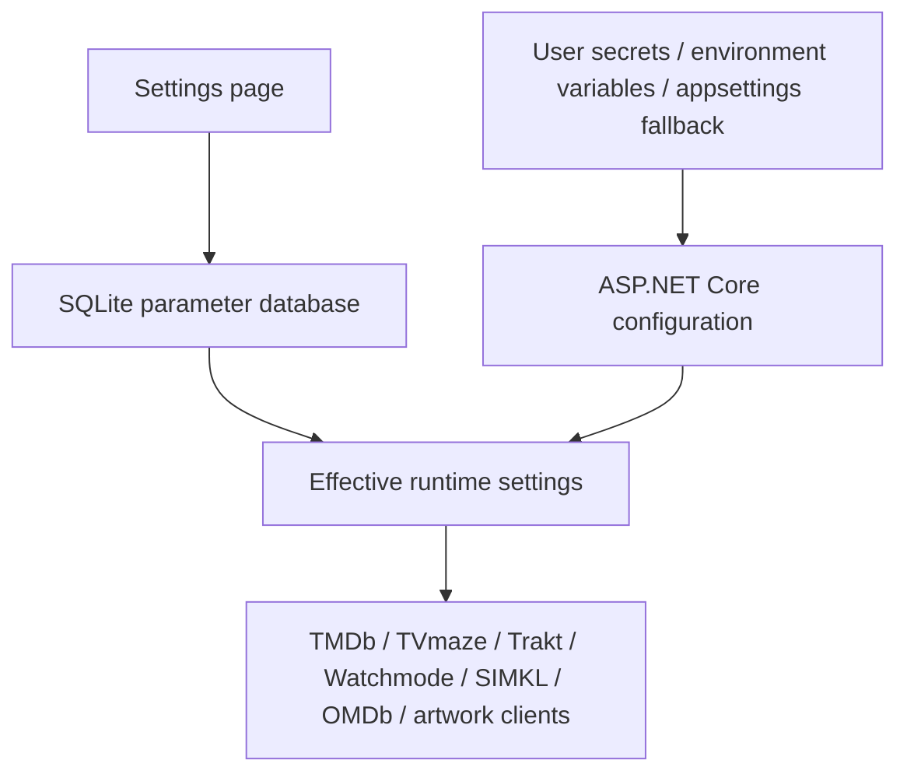
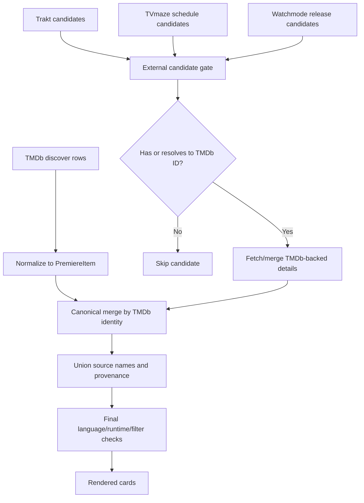
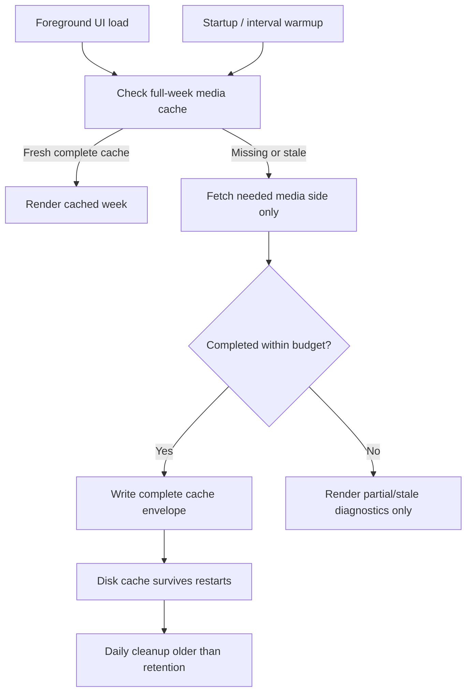
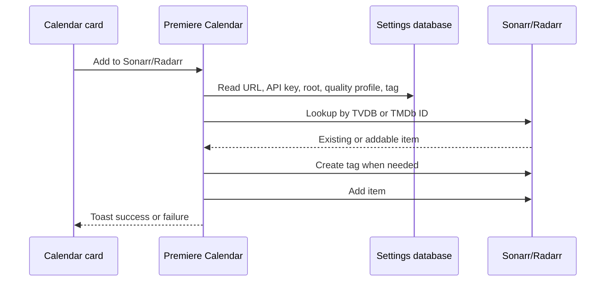

# Troubleshooting

This page is the operational checklist for slow loads, missing cards, provider setup, and cache problems.

## Quick Checks

- Open `/settings` and confirm each provider state is `Configured`, `Online`, `Needs setup`, or `Disabled`.
- Open `/health`; it should return a healthy response from the running app.
- Check the configured settings database path. Source keys edited in the UI are stored in SQLite, not in `appsettings.json`.
- Check `App_Data/cache/calendar` and `App_Data/cache/images` for persistent cache files. Release installs usually put these under `C:\ProgramData\PremiereCalendar`.
- If a foreground load stops after the budget, use the loaded-source filters and progress details to see which provider was incomplete.

## Settings Precedence

Runtime settings edited in the UI win over fallback configuration. Fallback values are still useful for first launch and service installs.



If a value looks correct in `appsettings.json` but not in the app, the SQLite value may be overriding it. Update it in `/settings`, or move the database aside only when you intentionally want a clean settings reset.

## Provider Matrix

| Provider | Default | Credential | Role | Cache behavior | Failure behavior | Settings location |
| --- | --- | --- | --- | --- | --- | --- |
| TMDb | Required | V4 read token | Canonical movie/series identity, discovery, details, posters, trailers, watch providers | Memory cache plus persisted week cache | Without it, live discovery cannot work | Calendar discovery |
| TVmaze | Enabled | None | TV enrichment, series-only schedule candidates, fallback TV image | 60-minute schedule cache, 7-day enrichment/image cache | Skipped candidates or `0 cards` source chip on series/all views | Calendar discovery / artwork |
| Trakt | Enabled when client ID exists | Client ID | Movie and new-show calendar candidates | Memory cache | Source chip can fail without dropping TMDb rows | Calendar discovery |
| Watchmode | Disabled until key | API key | Streaming availability and release candidates | Memory cache, coalesced misses | Source fallback is skipped; cards remain | Streaming availability / calendar discovery |
| SIMKL | Disabled until OAuth token | Client ID, client secret, OAuth access token | Account/library sync state only | Activity-gated sync state cache | Sync remains idle until authorized | Watch-state sync |
| OMDb | Disabled | API key | IMDb, Rotten Tomatoes, Metacritic, plot, poster candidate | 7-day memory cache | Scores show `n/a`; poster fallback skipped | Score provider |
| Fanart.tv | Disabled until key | API key | Artwork-only fallback | 7-day memory cache | Artwork provider skipped | Artwork provider |
| TheTVDB | Disabled until key | API key | Series artwork fallback | 7-day memory cache and token cache | Artwork provider skipped | Artwork provider |
| Wikimedia | Enabled | None | Final reusable image fallback | Memory cache | Artwork provider skipped | Artwork provider |
| Sonarr | Disabled | URL and API key | Add series action | Settings cache for options | Card add action hidden or toast error | Library apps |
| Radarr | Disabled | URL and API key | Add movies action | Settings cache for options | Card add action hidden or toast error | Library apps |

## Source Merge

TMDb remains canonical. External discovery providers may add candidates, but only TMDb-backed candidates become cards. Equivalent external candidates are collapsed before rendering, and provider/source names are unioned.



If duplicate services report the same movie, the current rule keeps one `movie:{tmdbId}` card, picks the earliest matching date in the week, and unions source names. Series exact episodes keep distinct `SxxEyy` cards when a provider supplies season and episode numbers.

## Cache Lifecycle

Week and image caches are persisted on disk. Cache cleanup removes old entries after the retention window; current and hot filter profiles are retained by usage tracking.



Warmup is a wake/check process, not a forced remote refresh loop. Routine warmup calls use `forceRefresh: false`, so fresh disk and memory caches are reused. Foreground loads have priority; background warmup skips or stops when the coordinator reports active foreground work. Each wake checks week-cache metadata and only starts up to `CalendarWarmup:MaximumRemoteWindowsPerWake` missing or stale windows, so a cold install fills the long-range cache gradually instead of hammering providers on boot.

## Integration Add Flow

Sonarr and Radarr actions depend on configured app options and identity enrichment.



If Sonarr add fails, check that the series card has a TVDB ID. If Radarr add fails, check the Radarr URL/API key and root folder/quality profile settings.

## Common Problems

### Missing Credentials

TMDb needs a V4 read token for live calendar data. Watchmode, OMDb, Fanart.tv, TheTVDB, Sonarr, and Radarr require keys only when those features are enabled. SIMKL requires the PIN authorization flow to save an OAuth access token before sync starts.

### Settings Database Path

Development default:

```text
App_Data/data/premiere-calendar.db
```

Release install default:

```text
C:\ProgramData\PremiereCalendar\data\premiere-calendar.db
```

If settings disappear after an update, verify the service environment still points `AppDatabase__Path` at the persistent database.

### Stale Or Corrupt Calendar Cache

Delete only the affected week files under `App_Data/cache/calendar` or the configured release cache directory. The filename starts with the Monday and Sunday dates. Refreshing the page will rebuild the missing key. Avoid deleting the whole cache unless you intentionally want a cold start.

### Slow TVmaze Or Broad Week Loads

TVmaze schedule output is cached by TVmaze and locally for about 60 minutes. Broad every-episode weeks can still be expensive because each candidate must map back to TMDb before it can become a card. Use new-series mode, language filters, or disable TVmaze schedule discovery when you want a faster TMDb-only view.

### Rate Limits

TMDb uses a local request limiter and honors `Retry-After` on `429`. The limiter has both `Tmdb:MaxRequestsPerSecond` and `Tmdb:MaxConcurrentRequests`; if TMDb chips frequently time out, lower the concurrency cap before raising timeouts. TVmaze and Watchmode requests also honor retry behavior where available and are protected by provider-level concurrency caps. If provider chips show failures during repeated manual refreshes, wait for the provider cache window instead of repeatedly forcing refresh.

### Request Storm Protection

The app intentionally has several independent caps:

- `CalendarWarmup:MaximumRemoteWindowsPerWake` limits cold-cache warmup spread per wake.
- `Tmdb:MaxConcurrentRequests` limits TMDb discover, detail, and external-ID calls across all loads.
- `Tvmaze:MaxConcurrentRequests` and `Watchmode:MaxConcurrentRequests` limit provider HTTP calls across foreground, prefetch, and warmup.
- `ImageCache:MaxConcurrentDownloads` limits remote poster/backdrop downloads triggered by lazy image loading.

Keep these lower than provider rate-limit ceilings. They protect the app from local fan-out and usually improve reliability more than simply increasing request timeouts.

### Foreground Load Budget

`CalendarLoad:ForegroundLoadBudgetSeconds` defaults to `30`. When the budget expires, the page renders best-effort results and adds a load-budget progress entry. Increase the value only if you prefer waiting longer over seeing partial diagnostics.

### Image Cache Failures

The image endpoint only accepts HTTPS URLs from allowed hosts. If posters fail, check `ImageCache:AllowedHosts`, disk permissions in the image cache directory, `ImageCache:MaxBytes`, and `ImageCache:MaxConcurrentDownloads`.

### Service, Port, Or Firewall

The app binds to `http://0.0.0.0:5298` by default. For LAN access, confirm the Windows service is running, port `5298` is listening, and the firewall rule allows inbound TCP `5298` from the local subnet.

### SIMKL PIN Flow

The SIMKL button starts a PIN authorization. Open the SIMKL link, approve access, return to Settings, then use the authorization check/save action. Continuous sync remains idle until an OAuth access token is saved, and sync checks should be activity-gated rather than unconditional background polling.
