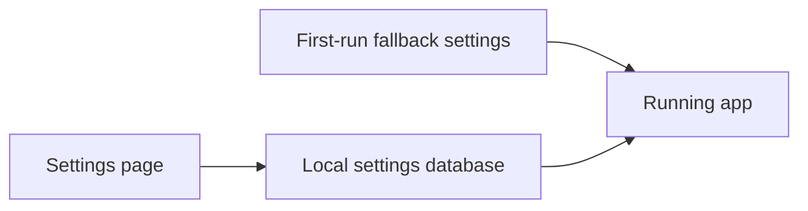

# Troubleshooting

Use this page when something looks wrong. Start at the top.

## Quick Checks

1. Open the app.
2. Click the cog icon.
3. Check that TMDb is configured.
4. Click Save.
5. Go back to the calendar.
6. Click Refresh sources.

If the app is installed as a service, also open:

```text
http://localhost:5298/health
```

You should see a healthy response.

## Shortcuts

| Action | Shortcut |
| --- | --- |
| Previous day | Left Arrow |
| Next day | Right Arrow |
| Yesterday from top edge | Keep scrolling upward |
| Tomorrow from bottom edge | Keep scrolling downward |
| Show source details | Source details |
| Hide source details | Hide sources |
| Open filters | Filter button |
| Open actions | Ctrl+K or Actions |
| Open settings | Cog icon |

Arrow keys are ignored while you type in an input field.

## Common Problems

| Problem | What to do |
| --- | --- |
| No cards load | Add a TMDb token in Settings, save, then click Refresh sources |
| Refresh seems slow | Wait for the foreground budget, then open Source details or check Settings > Local status |
| TVmaze is always slow | Use new-series mode, choose fewer languages, or disable TVmaze schedule discovery |
| Watchmode shows no cards | That is expected; Watchmode is used as availability fallback, not broad discovery |
| IMDb scores are missing | Wait for the IMDb dataset import to finish, then click Refresh sources |
| Rotten Tomatoes or Metacritic is missing | Enable OMDb with a working API key, then run Backfill scores in Settings |
| IMDb or TVDB IDs are missing | Run Repair IDs in Settings after TMDb is configured |
| Posters are missing | Check artwork provider settings, then click Refresh sources |
| Settings do not match `appsettings.json` | The Settings page wins; change values in the app |
| Signed GitHub update is disabled | Check `ApplicationUpdate:UpdaterScriptPath`, `InstallRoot`, `DataRoot`, and the latest transcript in Settings > Local status |
| Signed GitHub update refuses to run | Confirm an offline install pinned `updater/signing.cer`, the service account can write the data/install roots, and no other update is running |
| Sonarr add fails | The series needs a TVDB ID and valid Sonarr settings |
| Radarr add fails | Check Radarr URL, API key, root folder, and quality profile |

## What The Source Panel Means

Source diagnostics are compact by default and appear only when there is useful source progress or cached source detail to show.

- The number is the total cards found.
- Click Source details to see each provider.
- A provider with `0 cards` did not add matching cards for the current filters.
- A timed-out provider was skipped so the page could finish.
- Clicking a source chip filters the visible cards to that source only.

Source details and Settings can also show week anomalies. A low-count warning means the week has fewer cards than expected for the active mode and filters. A language-skew warning means one original language dominates the week. Missing-score, missing-ID, and unmapped-candidate warnings point to enrichment or mapping gaps rather than a rendering problem.

## Card Provenance

Open a card's provenance/details section when the date, score, or source looks wrong.

- Date confidence explains whether the row came from TMDb first air date, season 1 episode 1, an episode air date, a movie release date, or an external provider date.
- Merge contributions show which providers contributed and how they matched IDs.
- Missing-data reasons explain absent IMDb IDs, TVDB IDs, Rotten Tomatoes, IMDb scores, posters, trailers, or source names.

## Cache

Calendar, image, IMDb rating, OMDb response, and provider-sync cache data are stored on disk. They survive app restarts, crashes, and updates.

Refresh sources does not delete everything. It checks the week again and reuses useful existing details when it can.

Settings maintenance actions can update cached weeks without clearing the whole cache. Use Backfill scores after IMDb or OMDb data becomes available. Use Repair IDs when cards lack IMDb, TVDB, or Wikidata IDs but TMDb details can fill them.

If the cache looks wrong, delete only the affected week under:

```text
App_Data/cache/calendar
```

Installed service data is usually under:

```text
C:\ProgramData\PremiereCalendar
```

## Settings

The app stores Settings-page values in a local database, not in the browser.



This is why changing `appsettings.json` may not change the running app after you already saved settings in the UI.

## View Sync

View sync is off until a browser joins a group in Settings.

Settings shows one block per group. Each block shows the attached browsers and the latest saved All, Series, and Movies URLs. The current browser has a `me` badge.

| Problem | Try this |
| --- | --- |
| Another computer does not follow | Check both browsers use the same View sync group |
| The wrong browser name shows | Rename it in Settings, then Save view sync |
| You want to stop syncing | Click Ungroup this device |
| A copied URL does not follow the group | URLs with filters are treated as intentional and become the newest group view |
| Series does not follow Movies | This is expected. All, Series, and Movies sync separately |
| Local filters appear instead | The group has no saved URL for that route, or this browser is not in a group |

Only `/`, `/series`, and `/movies` URLs are synced. Settings, About, and external links are ignored.

## Providers

| Provider | Use it for |
| --- | --- |
| TMDb | Main calendar data. Required. |
| IMDb datasets | IMDb score and vote count. Included. |
| Trakt | Extra candidates. Optional. |
| TVmaze | Extra series schedule data. Optional. |
| Watchmode | Streaming availability fallback. Optional. |
| OMDb | Rotten Tomatoes, Metacritic, plot, poster fallback. Optional. |
| Fanart.tv, TheTVDB, Wikimedia | Poster fallback. Optional. |
| SIMKL | Account/library sync state. Optional. |
| Sonarr, Radarr | Add buttons. Optional. |

## When You Still Need Help

Send:

- the page URL,
- which day is selected,
- which filters are enabled,
- what Source details says after opening it.
